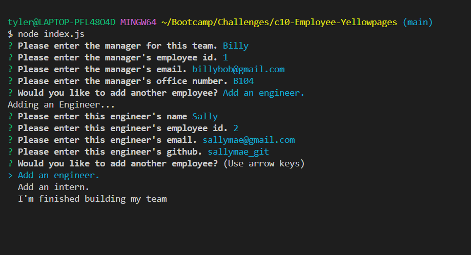

# Employee-Yellowpages

[Project DEMO](https://www.loom.com/share/4469e6e5ed694069893783f9c0bfc12d)

--- 

## TABLE OF CONTENTS 

[Description](#description)

[Installation](#installation)

[Usage](#usage)

[Contributions](#contributions)

[Testing](#testing)

[License](#license) 

[Questions](#questions)

---

## DESCRIPTION

Week 10 Challenge for Full-Stack Programming bootcamp at the University of Washington in partnership with edX. This program runs in node and creates a dynamic html page to display user input about all of the employees on a team. 

---

## INSTALLATION 

This project runs using node. Follow the necessary installation for these programs. 

Then, in the normal terminal, run the code "npm i" into node to install the necessary packages.

---

## USAGE

To start the command line application, run node index.js in the node terminal. You will then be prompted to enter information about the manager of the team you are creating. You can then add as many engineers and interns to the team as you want! When you have entered everyone, select that you are done creating your team and your html and css files will be created in the public directory!

---

## CONTRIBUTIONS

[Starter Code](https://github.com/coding-boot-camp/potential-enigma)

---

## TESTING

Jest is used to test the Employee, Engineer, Intern and Manager Classes. To verify that these classes are creating the proper object properties, simply enter npm run test in the node terminal!

---

## LICENSE 

MIT License
      Copyright (c) 2023 tykervella
      
      Permission is hereby granted, free of charge, to any person obtaining a copy
      of this software and associated documentation files (the "Software"), to deal
      in the Software without restriction, including without limitation the rights
      to use, copy, modify, merge, publish, distribute, sublicense, and/or sell
      copies of the Software, and to permit persons to whom the Software is
      furnished to do so, subject to the following conditions:
      
      The above copyright notice and this permission notice shall be included in all
      copies or substantial portions of the Software.
      
      THE SOFTWARE IS PROVIDED "AS IS", WITHOUT WARRANTY OF ANY KIND, EXPRESS OR
      IMPLIED, INCLUDING BUT NOT LIMITED TO THE WARRANTIES OF MERCHANTABILITY,
      FITNESS FOR A PARTICULAR PURPOSE AND NONINFRINGEMENT. IN NO EVENT SHALL THE
      AUTHORS OR COPYRIGHT HOLDERS BE LIABLE FOR ANY CLAIM, DAMAGES OR OTHER
      LIABILITY, WHETHER IN AN ACTION OF CONTRACT, TORT OR OTHERWISE, ARISING FROM,
      OUT OF OR IN CONNECTION WITH THE SOFTWARE OR THE USE OR OTHER DEALINGS IN THE
      SOFTWARE.
      

## QUESTIONS

--- 

Any Questions regarding this project can be directed to me personally. You can find me at [github](https://github.com/tykervella) or send me an email at tylerkervella@gmail.com.